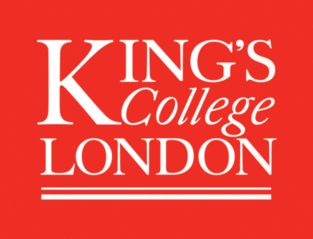
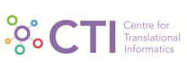

Welcome to Cogstack
===================
Cogstack is an information retrieval and extraction platform which implements best-of-breed enterprise search, natural language processing, analytics and visualisation technologies to unlock the health record and assist in clinical decision making and research.

Electronic health record systems are often closed, proprietary and contain incomplete and unstructured data. The result is that the wealth of information potentially available within health records is often inaccessible and underused.

Cogstack implements new data mining techniques within NHS Trusts – specifically, the ability to search any clinical data source (unstructured and structured), and Natural Language Processing applications developed to automate information extraction of medical concepts.

These tools allow clinical text to be searched for specific terms using simple or complex syntax, rapidly retrieving the data needed to answer complex queries such as “has this patient received any high cost treatments that have not been captured in their discharge summary?” or “provide me with patients with early onset Parkinson’s disease”.

So far, at the King's College Hospital deployment over 12 million free text documents and over 250 million diagnostic results and reports have been processed within CogStack, with live updates processes at near real-time. The speed at which queries can be developed, results returned and refined is very powerful tool for data expoloration and has allowed clinical trials to find and recruit patients who would have otherwise been difficult to locate. Further extensions enable opportunities for live alerting based on information recorded in the clinical record and semantic search providing enabling both service improvement which are being explored at King's.

We are currently working with a number of NHS Foundation Trusts (South London and Maudsley, King’s College Hospital, and University College London University Hospitals) to implement this platform, resulting in lasting improvements to recruitment, business intelligence and research capabilities.

CogStack Ecosystem
------------------

 * [CogStack-Search](https://github.com/CogStack/cogstack) A Distributed, fault tolerant batch processing for Natural Language Applications and Search, using remote partitioning

 * [CogStack-SemEHR](https://github.com/CogStack/SemEHR) Surfacing Semantic Data from Clinical Notes in Electronic Health Records for Tailored Care, Trial Recruitment and Clinical Research
 
 * [CogStack-TR](https://github.com/CogStack/CogStack-TR)Trial Recruitment made easy by using CogStack and SemEHR to automatically match patients to Trials and Trials to Patients (using Trials Inclusion/Exclusion Criteria from AACT database from ClinicalTrials.cov and UK Trials Gateway)
 
 * [CogStack-Timeline](https://github.com/CogStack/patient-timeline) Patient Timeline Browser, inlcuding full search text capabilities.

       
